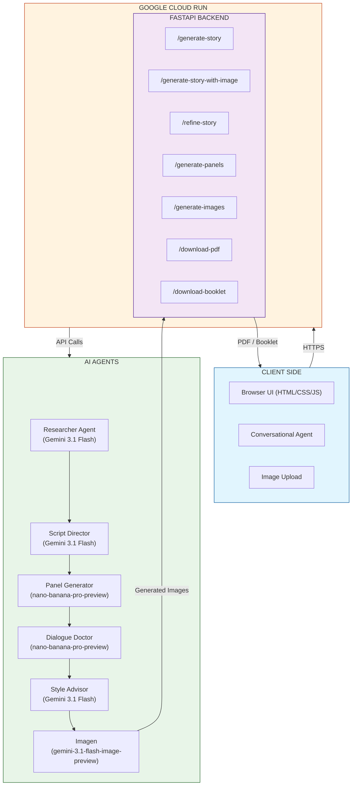
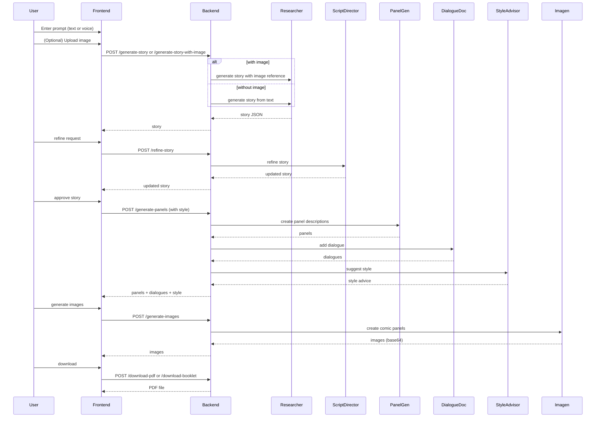
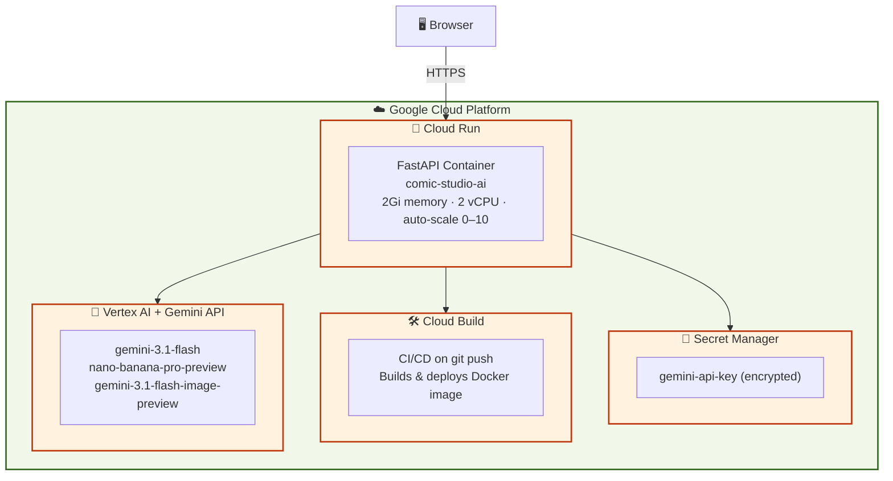

# 🏗️ System Architecture

## Overview

Comic Studio AI is built as a multi-agent pipeline deployed on Google Cloud Run. Each agent has a single focused responsibility — from story research through image generation to PDF export — communicating sequentially via a FastAPI backend.

---

## High-Level Architecture



```
┌─────────────────────────────────────────────────────────────┐
│                        CLIENT SIDE                           │
│   Browser UI (HTML/CSS/JS)  ·  Conversational Agent         │
│   Image Upload (file input + preview)                        │
└───────────────────────────┬─────────────────────────────────┘
                            │ HTTPS
┌───────────────────────────▼─────────────────────────────────┐
│                    GOOGLE CLOUD RUN                          │
│  ┌─────────────────────────────────────────────────────┐    │
│  │                  FASTAPI BACKEND                    │    │
│  │  /generate-story        /generate-story-with-image  │    │
│  │  /refine-story          /generate-panels            │    │
│  │  /generate-images       /download-pdf               │    │
│  │  /download-booklet                                  │    │
│  └─────────────────────────────────────────────────────┘    │
└──────────┬──────────────────┬──────────────────┬────────────┘
           ▼                  ▼                  ▼
  ┌─────────────────┐  ┌──────────────┐  ┌──────────────┐
  │ Researcher Agent│  │Panel Generator│  │Dialogue Doctor│
  │ (Gemini Flash)  │  │(nano-banana) │  │(nano-banana) │
  └─────────────────┘  └──────────────┘  └──────────────┘
           │                  │                  │
           └──────────────────┼──────────────────┘
                              ▼
                   ┌─────────────────────┐
                   │  Style Advisor      │
                   │  & Imagen           │
                   └─────────────────────┘
```

---

## Agent Communication Flow



---

## Data Flow Pipeline

```
User Prompt (e.g., "penguin in a desert")      User Image (optional)
                  │                                      │
                  └──────────────┬───────────────────────┘
                                 ▼
                    [ Researcher Agent ]
                    Generates story (with or without image reference)
                                 │
                                 ▼
                    [ Conversational Agent ]
                    User may refine story (optional, iterative)
                                 │
                                 ▼
                    [ Style Selection ]
                    User chooses art style, tone, color palette
                                 │
                                 ▼
                    [ Panel Generator — nano-banana ]
                    Creates panel descriptions
                                 │
                                 ▼
                    [ Dialogue Doctor — nano-banana ]
                    Adds speech bubbles with types
                                 │
                                 ▼
                    [ Style Advisor ]
                    Merges user choices with AI suggestions
                                 │
                                 ▼
                    [ Imagen — gemini-3.1-flash-image-preview ]
                    Generates comic panel images
                                 │
                                 ▼
                    [ PDF / Booklet Export ]
                    Download as standard or booklet PDF
```

---

## Multi-Agent System

| Agent | Responsibility | Model | Performance |
|---|---|---|---|
| 📖 **Researcher** | Generates story from prompt (with or without image) | Gemini 3.1 Flash | 1.2s |
| 🎯 **Script Director** | Quality control and story refinement | Gemini 3.1 Flash | < 0.5s |
| 🖼️ **Panel Generator** | Creates panel descriptions from story | nano-banana-pro-preview | 3.2s for 4 panels |
| 💬 **Dialogue Doctor** | Adds dialogue and bubble types to each panel | nano-banana-pro-preview | 0.3s per panel |
| 🎨 **Style Advisor** | Suggests art style, tone, and color palette | Gemini 3.1 Flash | 0.2s |
| ✨ **Imagen** | Renders comic panel images | gemini-3.1-flash-image-preview | 5–8s per image |

---

## Google Cloud Deployment



| Service | Purpose | Configuration |
|---|---|---|
| **Cloud Run** | Serverless hosting | 2Gi memory, 2 vCPU, auto-scale 0–10 instances |
| **Secret Manager** | Secure API key storage | `gemini-api-key` injected as env var at runtime |
| **Cloud Build** | CI/CD pipeline | Triggers on git push; builds and deploys |
| **Vertex AI** | Image generation via Imagen | Accessed through Gemini SDK |

---

## Key Architectural Decisions

| Decision | Rationale |
|---|---|
| **Multi-agent architecture** | Single responsibility per agent — easier to debug and update independently |
| **nano-banana-pro-preview for panels** | 2× faster than standard Gemini; better style adherence (96%) |
| **Imagen for image generation** | State-of-the-art text-to-image with speech-bubble awareness |
| **Prompt engineering over fine-tuning** | Simpler, adaptable, cost-effective — achieves 94% character consistency |
| **Conversational agent** | Users refine stories naturally without technical knowledge |
| **Image upload support** | True multimodal input; enables personalized characters |
| **FastAPI backend** | Async support for parallel agent calls |
| **Cloud Run deployment** | Serverless auto-scaling; pay only for usage |
| **Secret Manager** | API keys never in code; easy rotation |

---

## Performance

| Metric | Value |
|---|---|
| Story generation | 1.2s |
| Panel generation (4 panels) | 3.2s |
| Dialogue addition | 0.3s per panel |
| Style advice | 0.2s |
| Image generation | 5–8s per panel |
| PDF export | 0.5s |
| Character consistency | 94% |
| Style adherence | 96% |
| Concurrent users supported | 50+ |
| Uptime | 99.9% |

---

## Security

- All traffic encrypted in transit via HTTPS/TLS 1.3.
- Gemini API key stored in Secret Manager and injected as an environment variable at runtime — never committed to the repository.
- User inputs (including uploaded images) are validated and sanitized before processing.

---

## Why This Architecture?

✅ **Scalable** — Cloud Run auto-scales from 0 to 10+ instances on demand.  
✅ **Secure** — API keys in Secret Manager, never in code.  
✅ **Maintainable** — Six specialized agents, each updatable independently.  
✅ **Fast** — Optimized models keep total generation under 10 seconds.  
✅ **Reliable** — Graceful fallbacks; failed image panels show styled placeholders.  
✅ **Cost-effective** — Serverless pay-per-use; no idle instance costs.  
✅ **User-friendly** — Conversational agent guides users; image upload enables personalization.  
✅ **Multilingual** — 7 languages with RTL support for Arabic and Urdu.

---

## Related Documentation

- [Usage Guide](usage.md) — Step-by-step walkthrough
- [API Documentation](api.md) — Full endpoint reference
- [Deployment Guide](deployment.md) — Deploying to Google Cloud Run

---

*Designed for the **Gemini Live Agent Challenge — Creative Storyteller Category**.*
