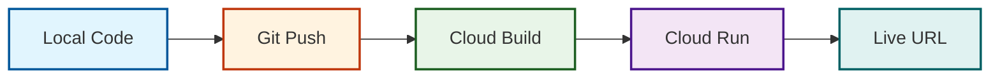

# 🚀 Deployment Guide - Comic Studio AI

## 📋 Table of Contents
- [✅ Prerequisites](#-prerequisites)
- [⚡ Quick Deployment Overview](#-quick-deployment-overview)
- [📦 Step-by-Step Deployment](#-step-by-step-deployment)
- [☁️ Google Cloud Setup](#️-google-cloud-setup)
- [🔐 Secret Manager Configuration](#-secret-manager-configuration)
- [🚀 Cloud Run Deployment](#-cloud-run-deployment)
- [📦 Container Image Reference](#-container-image-reference)
- [🔄 CI/CD Pipeline with Cloud Build](#-cicd-pipeline-with-cloud-build)
- [🌐 Custom Domain Setup](#-custom-domain-setup)
- [📊 Monitoring & Logging](#-monitoring--logging)
- [⚙️ Scaling Configuration](#️-scaling-configuration)
- [🐛 Troubleshooting](#-troubleshooting)
- [💰 Cost Optimization](#-cost-optimization)
- [🔒 Security Best Practices](#-security-best-practices)
- [↩️ Rollback Procedures](#️-rollback-procedures)
- [📝 Environment Variables](#-environment-variables)
- [✅ Post-Deployment Verification](#-post-deployment-verification)
- [📚 Additional Documentation](#-additional-documentation)

---

## ✅ Prerequisites

Before deploying, ensure you have:

| Requirement | Version/Details |
|-------------|-----------------|
| **Google Cloud Account** | Active billing account |
| **Google Cloud SDK** | Latest version (`gcloud --version`) |
| **Git** | 2.x or higher |
| **Python** | 3.9 or higher |
| **Gemini API Key** | From [Google AI Studio](https://aistudio.google.com/apikey) (must have access to `gemini-3.1-flash`, `nano-banana-pro-preview`, and `gemini-3.1-flash-image-preview`) |
| **Project ID** | Your Google Cloud Project ID |

---

## ⚡ Quick Deployment Overview



**Total Time:** ~5-10 minutes

---

## 📦 Step-by-Step Deployment

### 1. **Clone the Repository**

```bash
git clone https://github.com/RobinaMirbahar/Comic-Studio-Ai.git
cd Comic-Studio-Ai
```

### 2. **Set Up Google Cloud Project**

```bash
# Login to Google Cloud
gcloud auth login

# Set your project ID
export PROJECT_ID="your-actual-project-id"
gcloud config set project $PROJECT_ID

# Enable required APIs
gcloud services enable \
    run.googleapis.com \
    secretmanager.googleapis.com \
    cloudbuild.googleapis.com \
    aiplatform.googleapis.com
```

### 3. **Store Gemini API Key in Secret Manager**

```bash
# Create a secret for your Gemini API key
echo -n "YOUR_GEMINI_API_KEY_HERE" | \
    gcloud secrets create gemini-api-key \
    --data-file=- \
    --replication-policy="automatic"

# Grant Cloud Run access to the secret
export PROJECT_NUMBER=$(gcloud projects describe $PROJECT_ID --format='value(projectNumber)')
gcloud secrets add-iam-policy-binding gemini-api-key \
    --member="serviceAccount:${PROJECT_NUMBER}-compute@developer.gserviceaccount.com" \
    --role="roles/secretmanager.secretAccessor"
```

### 4. **Deploy to Cloud Run**

```bash
gcloud run deploy comic-studio-ai \
    --source . \
    --platform managed \
    --region us-central1 \
    --allow-unauthenticated \
    --memory 2Gi \
    --cpu 2 \
    --timeout 300 \
    --concurrency 80 \
    --min-instances 1 \
    --max-instances 10 \
    --set-secrets=GEMINI_API_KEY=gemini-api-key:latest
```

After deployment, you'll get a URL like:
```
https://comic-studio-ai-xxxxx-uc.a.run.app
```

---

## 📦 Container Image Reference

The application is packaged as a Docker image and is available at:

```
gcr.io/cloud-champion-innovator/comic-studio
```

You can pull it locally to inspect or run it:

```bash
# Pull the image
docker pull gcr.io/cloud-champion-innovator/comic-studio

# Run locally (replace with your API key)
docker run -p 8080:8080 -e GEMINI_API_KEY=your_key_here gcr.io/cloud-champion-innovator/comic-studio
```

This image is automatically built and pushed by Cloud Build during deployment. It is also the same image used by Cloud Run.

---

## 🔄 CI/CD Pipeline with Cloud Build

### `cloudbuild.yaml`

```yaml
steps:
  - name: 'gcr.io/cloud-builders/docker'
    args: ['build', '-t', 'gcr.io/$PROJECT_ID/comic-studio-ai', '.']
    id: 'build-image'

  - name: 'gcr.io/cloud-builders/docker'
    args: ['push', 'gcr.io/$PROJECT_ID/comic-studio-ai']
    id: 'push-image'

  - name: 'gcr.io/google.com/cloudsdktool/cloud-sdk'
    entrypoint: gcloud
    args:
      - 'run'
      - 'deploy'
      - 'comic-studio-ai'
      - '--image'
      - 'gcr.io/$PROJECT_ID/comic-studio-ai'
      - '--region'
      - 'us-central1'
      - '--platform'
      - 'managed'
      - '--allow-unauthenticated'
      - '--memory'
      - '2Gi'
      - '--cpu'
      - '2'
      - '--timeout'
      - '300'
      - '--concurrency'
      - '80'
      - '--min-instances'
      - '1'
      - '--max-instances'
      - '10'
      - '--set-secrets'
      - 'GEMINI_API_KEY=gemini-api-key:latest'
    id: 'deploy-to-cloud-run'

images:
  - 'gcr.io/$PROJECT_ID/comic-studio-ai'
timeout: 1800s
```

### Set Up Cloud Build Trigger

```bash
gcloud builds triggers create github \
    --name="comic-studio-ai-trigger" \
    --repository="https://github.com/RobinaMirbahar/Comic-Studio-Ai" \
    --branch="main" \
    --build-config="cloudbuild.yaml" \
    --substitutions="_PROJECT_ID=${PROJECT_ID}"
```

---

## 🌐 Custom Domain Setup

```bash
# Verify domain ownership
gcloud domains verify yourdomain.com

# Map custom domain to Cloud Run
gcloud beta run domain-mappings create \
    --service comic-studio-ai \
    --domain comic.yourdomain.com \
    --region us-central1
```

---

## 📊 Monitoring & Logging

```bash
# View logs
gcloud logging read "resource.type=cloud_run_revision AND resource.labels.service_name=comic-studio-ai" --limit 50

# Stream logs in real-time
gcloud logging tail "resource.type=cloud_run_revision AND resource.labels.service_name=comic-studio-ai"
```

---

## ⚙️ Scaling Configuration

```bash
# Update scaling settings
gcloud run services update comic-studio-ai \
    --region us-central1 \
    --min-instances 1 \
    --max-instances 20 \
    --concurrency 100
```

---

## 🐛 Troubleshooting

| Issue | Solution |
|-------|----------|
| **Deployment fails** | Check quota: `gcloud quotas list` |
| **Secret not found** | Verify secret exists and permissions |
| **API key invalid** | Regenerate API key in [Google AI Studio](https://aistudio.google.com/apikey) |
| **Memory limit exceeded** | Increase memory: `--memory 4Gi` |
| **Cold start slow** | Set `--min-instances=1` |

---

## 💰 Cost Optimization

```bash
# Set min-instances to 0 during development
gcloud run services update comic-studio-ai \
    --region us-central1 \
    --min-instances 0
```

---

## 🔒 Security Best Practices

```bash
# Rotate API key
gcloud secrets versions add gemini-api-key --data-file=new-key.txt
gcloud secrets versions disable gemini-api-key --version=1
```

---

## ↩️ Rollback Procedures

```bash
# List revisions
gcloud run revisions list --service comic-studio-ai --region us-central1

# Rollback to a specific revision (e.g., comic-studio-ai-00001)
gcloud run services update-traffic comic-studio-ai \
    --to-revisions=comic-studio-ai-00001=100 \
    --region us-central1
```

---

## 📝 Environment Variables

| Variable | Description | Required | Secret |
|----------|-------------|----------|--------|
| `GEMINI_API_KEY` | Google Gemini API key | ✅ Yes | ✅ |
| `PROJECT_ID` | Google Cloud Project ID | ✅ Yes | ❌ |

> **Note:** The app does not have a dedicated `/health` endpoint; the root endpoint serves the HTML interface, which is sufficient for verifying that the app is running.

---

## ✅ Post-Deployment Verification

After deployment, verify that the app is working:

```bash
# Get service URL
export SERVICE_URL=$(gcloud run services describe comic-studio-ai --region us-central1 --format='value(status.url)')

# Test root endpoint
curl $SERVICE_URL | head -20

# Test story generation
curl -X POST $SERVICE_URL/generate-story \
  -H "Content-Type: application/json" \
  -d '{"topic": "mouse on road", "language": "en", "panels": 4}'
```

---

## 📚 Additional Documentation

For more details on using Comic Studio AI, refer to the following internal documentation:

- [**Usage Guide**](docs/usage.md) – How to use the app, create comics, and refine stories.
- [**API Documentation**](docs/api.md) – Complete API reference for programmatic access.
- [**Architecture Overview**](docs/architecture.md) – Detailed explanation of the multi‑agent system and data flow.
- [**Performance Metrics**](docs/performance.md) – Benchmarking and accuracy details.

---

<div align="center">

**Deployed successfully?** [Let us know on Twitter!](https://twitter.com/robinamirbahar)

*This deployment guide was last tested on March 2026*  
*Comic Studio AI v2.0.0 – Gemini Live Agent Challenge*

</div>
