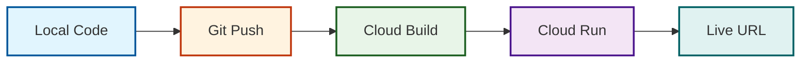

# 🚀 Deployment Guide - Comic Studio AI

## 📋 Table of Contents
- [Prerequisites](#prerequisites)
- [Quick Deployment Overview](#quick-deployment-overview)
- [Step-by-Step Deployment](#step-by-step-deployment)
- [Google Cloud Setup](#google-cloud-setup)
- [Secret Manager Configuration](#secret-manager-configuration)
- [Cloud Run Deployment](#cloud-run-deployment)
- [CI/CD Pipeline with Cloud Build](#cicd-pipeline-with-cloud-build)
- [Custom Domain Setup](#custom-domain-setup)
- [Monitoring & Logging](#monitoring--logging)
- [Scaling Configuration](#scaling-configuration)
- [Troubleshooting](#troubleshooting)
- [Cost Optimization](#cost-optimization)
- [Security Best Practices](#security-best-practices)
- [Rollback Procedures](#rollback-procedures)
- [Environment Variables](#environment-variables)
- [Post-Deployment Verification](#post-deployment-verification)

---

## ✅ Prerequisites

Before deploying, ensure you have:

| Requirement | Version/Details |
|-------------|-----------------|
| **Google Cloud Account** | Active billing account |
| **Google Cloud SDK** | Latest version (`gcloud --version`) |
| **Git** | 2.x or higher |
| **Python** | 3.9 or higher |
| **Gemini API Key** | From [Google AI Studio](https://makersuite.google.com/app/apikey) (must have access to `gemini-2.0-flash`, `nano-banana-pro-preview`, and `gemini-3.1-flash-image-preview`) |
| **Project ID** | Your Google Cloud Project ID |

---

## ⚡ Quick Deployment Overview



**Total Time:** ~5-10 minutes

---

## 📦 Step-by-Step Deployment

### 1. **Clone the Repository**

```bash
# Clone the repository
git clone https://github.com/RobinaMirbahar/Comic-Studio-Ai.git
cd Comic-Studio-Ai

# Verify you have all files
ls -la
```

Expected output includes `agents/`, `main.py`, `templates/index.html`, `Dockerfile`, `cloudbuild.yaml`, etc.

### 2. **Set Up Google Cloud Project**

```bash
# Login to Google Cloud
gcloud auth login
# Follow the browser prompt to authenticate

# Set your project ID (replace with your actual project ID)
export PROJECT_ID="your-actual-project-id"
gcloud config set project $PROJECT_ID

# Enable required APIs
gcloud services enable \
    run.googleapis.com \
    secretmanager.googleapis.com \
    cloudbuild.googleapis.com \
    aiplatform.googleapis.com  # Required for Imagen

# Verify enabled APIs
echo "✅ Enabled APIs:"
gcloud services list --enabled | grep -E "run|secretmanager|cloudbuild|aiplatform"
```

### 3. **Store Gemini API Key in Secret Manager**

```bash
# Create a secret for your Gemini API key
echo -n "YOUR_GEMINI_API_KEY_HERE" | \
    gcloud secrets create gemini-api-key \
    --data-file=- \
    --replication-policy="automatic"

# Get your project number
export PROJECT_NUMBER=$(gcloud projects describe $PROJECT_ID --format='value(projectNumber)')
echo "✅ Project Number: $PROJECT_NUMBER"

# Grant Cloud Run access to the secret
gcloud secrets add-iam-policy-binding gemini-api-key \
    --member="serviceAccount:${PROJECT_NUMBER}-compute@developer.gserviceaccount.com" \
    --role="roles/secretmanager.secretAccessor"

# Verify secret creation
echo "✅ Secret created:"
gcloud secrets list
gcloud secrets versions list gemini-api-key
```

### 4. **Configure Local Environment (Optional for Testing)**

```bash
# Create .env file from template (never commit this!)
cp .env.example .env

# Edit with your values
cat > .env << EOF
# Required
GEMINI_API_KEY=your_gemini_api_key_here
PROJECT_ID=${PROJECT_ID}
EOF

echo "✅ Local .env file created"
```

### 5. **Test Locally (Optional)**

```bash
# Create virtual environment
python -m venv venv
source venv/bin/activate  # On Windows: venv\Scripts\activate

# Install dependencies
pip install -r requirements.txt

# Run the app
python main.py

# Test in browser: http://localhost:8080
# Press Ctrl+C to stop
```

### 6. **Deploy to Cloud Run**

#### Option A: **Manual Deployment (Quick Start)**

```bash
# Build and deploy in one command
gcloud run deploy comic-studio-ai \
    --source . \
    --platform managed \
    --region us-central1 \
    --allow-unauthenticated \
    --memory 2Gi \
    --cpu 2 \
    --timeout 300 \
    --concurrency 80 \
    --min-instances 1 \
    --max-instances 10 \
    --set-secrets=GEMINI_API_KEY=gemini-api-key:latest

# Get the service URL
export SERVICE_URL=$(gcloud run services describe comic-studio-ai \
    --region us-central1 \
    --format='value(status.url)')
echo "✅ Deployed to: $SERVICE_URL"
```

#### Option B: **Deploy with Cloud Build (Recommended)**

```bash
# Submit build to Cloud Build
gcloud builds submit --config cloudbuild.yaml \
    --substitutions=_PROJECT_ID=${PROJECT_ID}

# Get the service URL after deployment
sleep 30  # Wait for deployment to complete
export SERVICE_URL=$(gcloud run services describe comic-studio-ai \
    --region us-central1 \
    --format='value(status.url)')
echo "✅ Deployed to: $SERVICE_URL"
```

### 7. **Verify Deployment**

```bash
# Test health endpoint
curl ${SERVICE_URL}/health

# Expected response: {"status":"healthy"}

# Test story generation
curl -X POST ${SERVICE_URL}/generate-story \
  -H "Content-Type: application/json" \
  -d '{"topic": "mouse on road", "language": "en", "panels": 4}'

# Open in browser
echo "🔍 Open in browser: $SERVICE_URL"
```

---

## 🔧 Cloud Build CI/CD Pipeline

### `cloudbuild.yaml` Configuration

```yaml
steps:
  # Step 1: Build the container image
  - name: 'gcr.io/cloud-builders/docker'
    args: ['build', '-t', 'gcr.io/$PROJECT_ID/comic-studio-ai', '.']
    id: 'build-image'

  # Step 2: Push to Container Registry
  - name: 'gcr.io/cloud-builders/docker'
    args: ['push', 'gcr.io/$PROJECT_ID/comic-studio-ai']
    id: 'push-image'

  # Step 3: Deploy to Cloud Run
  - name: 'gcr.io/google.com/cloudsdktool/cloud-sdk'
    entrypoint: gcloud
    args:
      - 'run'
      - 'deploy'
      - 'comic-studio-ai'
      - '--image'
      - 'gcr.io/$PROJECT_ID/comic-studio-ai'
      - '--region'
      - 'us-central1'
      - '--platform'
      - 'managed'
      - '--allow-unauthenticated'
      - '--memory'
      - '2Gi'
      - '--cpu'
      - '2'
      - '--timeout'
      - '300'
      - '--concurrency'
      - '80'
      - '--min-instances'
      - '1'
      - '--max-instances'
      - '10'
      - '--set-secrets'
      - 'GEMINI_API_KEY=gemini-api-key:latest'
    id: 'deploy-to-cloud-run'

# Store the built image
images:
  - 'gcr.io/$PROJECT_ID/comic-studio-ai'

# Set timeout for the whole build
timeout: 1800s
```

### Set Up Automatic Deployment on Git Push

```bash
# Create a Cloud Build trigger
gcloud builds triggers create github \
    --name="comic-studio-ai-trigger" \
    --repository="https://github.com/RobinaMirbahar/Comic-Studio-Ai" \
    --branch="main" \
    --build-config="cloudbuild.yaml" \
    --substitutions="_PROJECT_ID=${PROJECT_ID}"

# List triggers
gcloud builds triggers list
```

---

## 🌐 Custom Domain Setup

```bash
# Verify domain ownership
gcloud domains verify yourdomain.com

# Map custom domain to Cloud Run
gcloud beta run domain-mappings create \
    --service comic-studio-ai \
    --domain comic.yourdomain.com \
    --region us-central1

# Get the IP address to configure DNS
gcloud beta run domain-mappings describe \
    --service comic-studio-ai \
    --domain comic.yourdomain.com \
    --region us-central1
```

**DNS Configuration:**
| Record Type | Name | Value |
|-------------|------|-------|
| A | `comic` | `[IP address from above]` |
| CNAME | `www.comic` | `comic.yourdomain.com` |

---

## 📊 Monitoring & Logging

### View Logs

```bash
# View recent logs
gcloud logging read "resource.type=cloud_run_revision AND resource.labels.service_name=comic-studio-ai" \
    --limit 50 \
    --format json

# Stream logs in real-time
gcloud logging tail "resource.type=cloud_run_revision AND resource.labels.service_name=comic-studio-ai"
```

### Create a Monitoring Dashboard

```bash
# Create a simple dashboard
gcloud monitoring dashboards create \
    --display-name="Comic Studio AI Dashboard" \
    --config='{
        "displayName": "Comic Studio AI",
        "mosaicLayout": {
            "columns": 12,
            "tiles": [
                {
                    "width": 6,
                    "height": 4,
                    "widget": {
                        "title": "Request Count",
                        "xyChart": {
                            "dataSets": [{
                                "timeSeriesQuery": {
                                    "timeSeriesFilter": "metric.type=\"run.googleapis.com/request_count\" resource.type=\"cloud_run_revision\" resource.label.\"service_name\"=\"comic-studio-ai\""
                                }
                            }]
                        }
                    }
                }
            ]
        }
    }'
```

### Key Metrics to Monitor

| Metric | Command | Threshold |
|--------|---------|-----------|
| **Request Latency** | `gcloud logging read "httpRequest.latency>5s"` | > 5s |
| **Error Rate** | `gcloud logging read "severity>=ERROR"` | > 1% |
| **CPU Usage** | `gcloud run services describe comic-studio-ai` | > 80% |
| **Memory Usage** | `gcloud run services describe comic-studio-ai` | > 1.5Gi |

---

## ⚙️ Scaling Configuration

### Current Settings

```bash
# View current scaling
gcloud run services describe comic-studio-ai \
    --region us-central1 \
    --format='yaml(spec.template.spec)'
```

### Update Scaling Configuration

```bash
# Update scaling settings
gcloud run services update comic-studio-ai \
    --region us-central1 \
    --min-instances 1 \
    --max-instances 20 \
    --concurrency 100
```

### Recommended Scaling by Traffic Level

| Traffic Level | Min Instances | Max Instances | Concurrency |
|---------------|---------------|---------------|-------------|
| **Development** | 0 | 2 | 50 |
| **Low (<100 req/day)** | 1 | 5 | 80 |
| **Medium (100-1000 req/day)** | 2 | 10 | 100 |
| **High (>1000 req/day)** | 3 | 20 | 150 |
| **Launch/Promotion** | 5 | 30 | 200 |

---

## 🐛 Troubleshooting

### Common Issues and Solutions

| Issue | Symptom | Solution |
|-------|---------|----------|
| **Deployment fails** | `ERROR: (gcloud.run.deploy)` | Check quota: `gcloud quotas list` |
| **Secret not found** | `Secret manager error` | Verify secret exists and permissions |
| **API key invalid** | `Gemini API error: 403` | Regenerate API key in Google AI Studio |
| **Memory limit exceeded** | `Container terminated` | Increase memory: `--memory 4Gi` |
| **Timeout** | `Request timeout` | Increase timeout: `--timeout 600` |
| **Cold start slow** | First request >5s | Set `--min-instances=1` |
| **Image generation fails** | `Image generation failed` | Ensure API key has access to `gemini-3.1-flash-image-preview` |

### Debug Commands

```bash
# Check service status
gcloud run services describe comic-studio-ai --region us-central1

# View recent errors
gcloud logging read "resource.type=cloud_run_revision AND severity>=ERROR" --limit 20

# Check container configuration
gcloud run services describe comic-studio-ai \
    --region us-central1 \
    --format='yaml'

# Test locally with curl
curl -X POST http://localhost:8080/generate-story \
  -H "Content-Type: application/json" \
  -d '{"topic": "test"}'
```

---

## 💰 Cost Optimization

### Estimated Monthly Costs

| Component | Usage (10k requests/month) | Estimated Cost |
|-----------|----------------------------|----------------|
| **Cloud Run** | 10k requests, 1 instance avg | ~$5-8 |
| **Secret Manager** | 1 secret, 10k accesses | ~$1 |
| **Cloud Build** | 50 builds/month | ~$2 |
| **Gemini API** | 1k generations/month (text) + 500 images | ~$15-20 |
| **Total** | | **~$23-31/month** |

### Cost-Saving Tips

```bash
# 1. Set min-instances=0 during development
gcloud run services update comic-studio-ai \
    --region us-central1 \
    --min-instances 0

# 2. Create a budget alert
gcloud billing budgets create \
    --billing-account=YOUR_BILLING_ACCOUNT \
    --display-name="Comic Studio AI Budget" \
    --budget-amount=50 \
    --threshold-rule=percent=0.5 \
    --threshold-rule=percent=0.9

# 3. Monitor API usage
gcloud services quota list --service=run.googleapis.com

# 4. Clean up old revisions
gcloud run revisions list --service comic-studio-ai --region us-central1
# Delete old revisions manually in Console
```

---

## 🔒 Security Best Practices

### Secret Rotation

```bash
# Rotate API key every 90 days
gcloud secrets versions add gemini-api-key --data-file=new-key.txt

# Disable old version
gcloud secrets versions disable gemini-api-key --version=1

# List all versions
gcloud secrets versions list gemini-api-key
```

### IAM Roles (Principle of Least Privilege)

```bash
# Create dedicated service account
gcloud iam service-accounts create comic-studio-ai-sa \
    --display-name="Comic Studio AI Service Account"

# Grant minimal permissions
gcloud projects add-iam-policy-binding $PROJECT_ID \
    --member="serviceAccount:comic-studio-ai-sa@${PROJECT_ID}.iam.gserviceaccount.com" \
    --role="roles/run.invoker"

gcloud projects add-iam-policy-binding $PROJECT_ID \
    --member="serviceAccount:comic-studio-ai-sa@${PROJECT_ID}.iam.gserviceaccount.com" \
    --role="roles/secretmanager.secretAccessor"
```

### Container Security

```dockerfile
# Dockerfile security best practices
FROM python:3.9-slim

# Create non-root user
RUN useradd -m -u 1000 appuser

WORKDIR /app

# Copy and install dependencies
COPY requirements.txt .
RUN pip install --no-cache-dir -r requirements.txt && \
    chown -R appuser:appuser /app

# Copy application code
COPY --chown=appuser:appuser . .

# Switch to non-root user
USER appuser

# Run the application
CMD ["uvicorn", "main:app", "--host", "0.0.0.0", "--port", "8080"]
```

---

## ↩️ Rollback Procedures

### Rollback to Previous Version

```bash
# List all revisions
gcloud run revisions list --service comic-studio-ai --region us-central1

# Example output:
# comic-studio-ai-00001  ...  AGE 1d
# comic-studio-ai-00002  ...  AGE 2h  (current)

# Rollback to specific revision (e.g., 00001)
gcloud run services update-traffic comic-studio-ai \
    --to-revisions=comic-studio-ai-00001=100 \
    --region us-central1

# Gradual rollback (90% old, 10% new)
gcloud run services update-traffic comic-studio-ai \
    --to-revisions=comic-studio-ai-00001=90,comic-studio-ai-00002=10 \
    --region us-central1
```

### Automated Rollback Script

Create `scripts/rollback.sh`:

```bash
#!/bin/bash
# rollback.sh - Rollback to previous version

set -e

echo "🔄 Rolling back Comic Studio AI..."

# Get the previous revision (second latest)
PREVIOUS_REVISION=$(gcloud run revisions list \
    --service comic-studio-ai \
    --region us-central1 \
    --format='value(metadata.name)' \
    --limit 2 | tail -1)

echo "📋 Rolling back to: $PREVIOUS_REVISION"

# Confirm rollback
read -p "Continue? (y/n) " -n 1 -r
echo
if [[ $REPLY =~ ^[Yy]$ ]]; then
    # Perform rollback
    gcloud run services update-traffic comic-studio-ai \
        --to-revisions=${PREVIOUS_REVISION}=100 \
        --region us-central1
    
    echo "✅ Rollback complete!"
else
    echo "❌ Rollback cancelled"
fi
```

---

## 📝 Environment Variables Reference

| Variable | Description | Default | Required | Secret |
|----------|-------------|---------|----------|--------|
| `GEMINI_API_KEY` | Google Gemini API key | - | ✅ Yes | ✅ |
| `PROJECT_ID` | Google Cloud Project ID | - | ✅ Yes | ❌ |
| `PORT` | Server port | 8080 | ❌ No | ❌ |

All other settings (max panels, language, style) are handled via the frontend and do not require environment variables.

---

## ✅ Post-Deployment Verification Checklist

Create `scripts/verify.sh`:

```bash
#!/bin/bash
# verify.sh - Post-deployment verification script

set -e

echo "🔍 Verifying Comic Studio AI deployment..."
echo "=========================================="

# 1. Get service URL
SERVICE_URL=$(gcloud run services describe comic-studio-ai \
    --region us-central1 \
    --format='value(status.url)')
echo "📡 Service URL: $SERVICE_URL"

# 2. Test health endpoint
echo -n "🏥 Health check: "
HEALTH_STATUS=$(curl -s -o /dev/null -w "%{http_code}" ${SERVICE_URL}/health)
if [ "$HEALTH_STATUS" -eq 200 ]; then
    echo "✅ OK"
else
    echo "❌ Failed (HTTP $HEALTH_STATUS)"
    exit 1
fi

# 3. Test story generation
echo -n "📝 Story generation: "
STORY_RESPONSE=$(curl -s -X POST ${SERVICE_URL}/generate-story \
    -H "Content-Type: application/json" \
    -d '{"topic": "test", "language": "en", "panels": 4}')
if echo "$STORY_RESPONSE" | grep -q "title"; then
    echo "✅ OK"
else
    echo "❌ Failed"
    exit 1
fi

# 4. Check logs for errors
echo -n "📊 Error check: "
ERROR_COUNT=$(gcloud logging read "resource.type=cloud_run_revision AND severity>=ERROR" \
    --limit 1 --format=json | jq length)
if [ "$ERROR_COUNT" -eq 0 ]; then
    echo "✅ No recent errors"
else
    echo "⚠️ Found $ERROR_COUNT errors"
fi

# 5. Display service info
echo -e "\n📋 Service Information:"
gcloud run services describe comic-studio-ai \
    --region us-central1 \
    --format='table(name, status.url, spec.template.spec.containers[0].image, status.traffic[0].percent)'

echo -e "\n✅ Verification complete!"
```

Make the script executable:

```bash
chmod +x scripts/verify.sh
./scripts/verify.sh
```

---

## 📚 Additional Resources

- [Google Cloud Run Documentation](https://cloud.google.com/run/docs)
- [Secret Manager Documentation](https://cloud.google.com/secret-manager/docs)
- [Cloud Build Documentation](https://cloud.google.com/build/docs)
- [Gemini API Documentation](https://ai.google.dev/docs)
- [FastAPI Documentation](https://fastapi.tiangolo.com)

---

## 🆘 Support

If you encounter any issues:

1. **Check the logs**: `gcloud logging read "resource.type=cloud_run_revision"`
2. **Review GitHub Issues**: [https://github.com/RobinaMirbahar/Comic-Studio-Ai/issues](https://github.com/RobinaMirbahar/Comic-Studio-Ai/issues)
3. **Contact**: [mallah.robina@gmail.com](mailto:mallah.robina@gmail.com)
4. **Twitter**: [@robinamirbahar](https://twitter.com/robinamirbahar)

---

<div align="center">

**Deployed successfully?** [Let us know!](https://twitter.com/robinamirbahar)

*This deployment guide was last tested on March 2026*  
*Comic Studio AI v2.0.0 - Gemini Live Agent Challenge*

</div>
```
