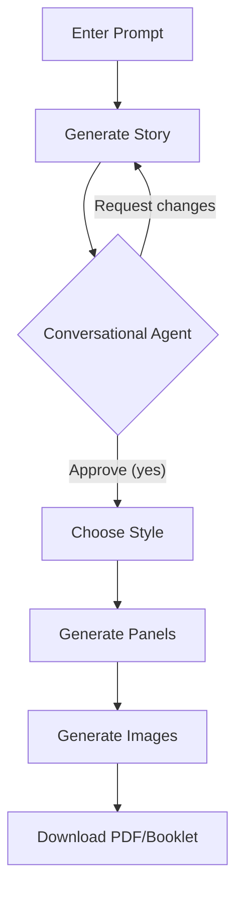

# 📖 Comic Studio AI - Usage Guide

## 📋 Table of Contents
- [Quick Start](#quick-start)
- [🎨 Your First Comic - Visual Guide](#-your-first-comic---visual-guide)
- [Web Interface Guide](#web-interface-guide)
- [Conversational Agent](#conversational-agent)
- [Style Selection](#style-selection)
- [Panel Count & Random Prompt](#panel-count--random-prompt)
- [Image Generation](#image-generation)
- [Download Options](#download-options)
- [API Usage Guide](#api-usage-guide)
- [Art Styles](#art-styles)
- [Languages](#languages)
- [Examples](#examples)
- [Troubleshooting](#troubleshooting)
- [📷 Adding Images to this Guide](#-adding-images-to-this-guide)

---

## 🚀 Quick Start

### 1. **Start the Server**
```bash
# Make sure you're in the project directory
cd Comic-Studio-Ai

# Activate virtual environment
source venv/bin/activate  # On Windows: venv\Scripts\activate

# Install minimal dependencies
pip install fastapi uvicorn python-dotenv google-generativeai Pillow reportlab

# Run the app
python main.py
```

### 2. **Open in Browser**
```
http://localhost:8080
```


---

## 🎨 Your First Comic - Visual Guide

### Step 1: Enter a Prompt & Adjust Settings
Type your idea in the text area, choose language, and select number of panels (1–6). Example: **"penguin in a desert"**

```
┌─────────────────────────────────────┐
│ Language: [English ▼]               │
│ [penguin in a desert]       [🎲]    │
│ Panels: [=====○=====] (4)           │
│ [1. Generate Story]                  │
└─────────────────────────────────────┘
```
[Image: Screenshot of the top section with language dropdown, prompt input, random button, and panel slider]

### Step 2: Generate Story
Click **"1. Generate Story"** – you'll see the AI-generated story with title, characters, and plot.

```
┌─────────────────────────────────────┐
│ 📖 Generated Story                   │
│ Desert Penguin Adventure             │
│ Characters:                          │
│ • Pingu – A lost penguin             │
│ • Cactus Carl – A grumpy cactus      │
│ Plot:                                 │
│ 1. Pingu wakes up in the desert...   │
│ 2. He asks Cactus Carl for water...  │
│ 3. Carl points to an oasis...        │
│ 4. Pingu finds water and friends.    │
└─────────────────────────────────────┘
```
[Image: Screenshot of generated story output with title, characters, and plot points]

### Step 3: Chat with the Conversational Agent
The agent appears and asks if you're satisfied. You can request changes like:
- `"add a dog character"`
- `"make the penguin braver"`
- `"change the ending to be funnier"`

Type your request, or simply say **"yes"** to proceed.

```
┌─────────────────────────────────────┐
│ 🎬 I've created a story. You can ask │
│    to change it, e.g., "add a dog".  │
│ 👤 add a dog                         │
│ 🎬 ⏳ Modifying...                    │
│ 🎬 Story updated!                     │
└─────────────────────────────────────┘
```
[Image: Screenshot of the chat box with agent message and user input]

### Step 4: Choose Your Style
After approving, select art style, language tone, and optional color palette.

```
┌─────────────────────────────────────┐
│ Art Style: [Manga ▼]                 │
│ Language Tone: [Adventurous ▼]       │
│ Color Palette: [warm]                 │
│ [2. Generate Panels]                  │
└─────────────────────────────────────┘
```
[Image: Screenshot of style selection dropdowns]

### Step 5: Generate Panels & Dialogue
Click **"2. Generate Panels"** – the app creates 4 panel descriptions with dialogue and bubble types.

```
┌─────────────────────────────────────┐
│ Panel 1: Wide desert shot, Pingu...  │
│ Characters: Pingu                     │
│ Dialogue: "Where's the water?"        │
│ (speech)                              │
│ Panel 2: Pingu meets Cactus Carl...   │
│ ...                                   │
└─────────────────────────────────────┘
```
[Image: Screenshot of panel descriptions with dialogue]

### Step 6: Generate Images
Click **"3. Generate Images"** – the app uses Imagen to create actual comic panels (may take 10–20 seconds).

```
┌─────────────────────────────────────┐
│ [Image of Panel 1]                   │
│ ✓ Real Imagen generation             │
│ [Image of Panel 2]                   │
│ ...                                   │
└─────────────────────────────────────┘
```
[Image: Screenshot of generated comic panels with speech bubbles]

### Step 7: Download Your Comic
Choose **PDF** (one panel per page) or **Booklet** (two panels per page, landscape). Files include the story title and a timestamp.

```
┌─────────────────────────────────────┐
│ [PDF]    [Booklet]                   │
│ comic_PenguinAdventure_12345678.pdf  │
└─────────────────────────────────────┘
```
[Image: Screenshot of download buttons and sample filename]

### 📸 Example Gallery

#### Example 1: "cat in a hospital" (Spanish, humorous)
| Panel 1 | Panel 2 | Panel 3 | Panel 4 |
|---------|---------|---------|---------|
| Cat enters hospital | Meets a dog nurse | Gets a checkup | Makes friends |
[Image: Collage of four panels from "cat in a hospital"]

#### Example 2: "robot on Mars" (English, adventurous)
| Panel 1 | Panel 2 | Panel 3 | Panel 4 |
|---------|---------|---------|---------|
| Robot lands | Explores crater | Finds alien | Sends message |
[Image: Collage of four panels from "robot on Mars"]

#### Example 3: "dragon at school" (Japanese, heartwarming)
| Panel 1 | Panel 2 | Panel 3 | Panel 4 |
|---------|---------|---------|---------|
| Dragon is nervous | Meets a friendly owl | Learns to breathe fire | Graduates |
[Image: Collage of four panels from "dragon at school"]

### 🎯 Visual Workflow



---

## 🖥️ Web Interface Guide

### Main Interface Sections

```
┌─────────────────────────────────────────────┐
│  HEADER & AGENT SHOWCASE                    │
│  (Researcher, Script Director, etc.)        │
├─────────────────────────────────────────────┤
│  LANGUAGE SELECTOR                           │
│  [English ▼]                                 │
├─────────────────────────────────────────────┤
│  PROMPT INPUT & RANDOM BUTTON                │
│  [penguin in a desert]          [🎲]        │
│  PANEL COUNT SLIDER                          │
│  [=====○=====] (4)                           │
│  [1. Generate Story]                         │
├─────────────────────────────────────────────┤
│  STORY OUTPUT                                │
│  (title, characters, plot)                   │
├─────────────────────────────────────────────┤
│  CONVERSATIONAL AGENT CHAT                   │
│  (appears after story)                       │
├─────────────────────────────────────────────┤
│  STYLE SELECTION (appears after approval)    │
│  Art Style ▼   Tone ▼   Palette ▼           │
│  [2. Generate Panels]                        │
├─────────────────────────────────────────────┤
│  PANELS & DIALOGUE OUTPUT                    │
├─────────────────────────────────────────────┤
│  IMAGE GENERATION & DOWNLOAD BUTTONS         │
│  [3. Generate Images] [PDF] [Booklet]       │
│  (generated images appear below)             │
└─────────────────────────────────────────────┘
```
[Image: Full-page screenshot of the entire web interface with numbered sections]

### Agent Tooltips
Hover over any agent card (Researcher, Script Director, etc.) to see a brief description of its role.

[Image: Screenshot showing a tooltip popup on an agent card]

---

## 💬 Conversational Agent

After story generation, the agent appears in a chat box. It helps you refine the story.

**How to use:**
- Type natural language requests like:
  - `"add a dog character"`
  - `"make the plot more adventurous"`
  - `"change the main character's name to Fluffy"`
  - `"make the ending happier"`
- The agent preserves existing characters and only adds/modifies as you ask.
- Say `"yes"` when you're satisfied to move to style selection.

**Example conversation:**
```
🎬 I've created a story. You can ask me to change it, e.g.:
   - 'add a dog character'
   - 'make the plot more adventurous'
   Just tell me, or say 'yes' to proceed.
👤 add a cat and a dog
🎬 ⏳ Modifying story...
🎬 Story updated! You can keep refining or say 'yes'.
👤 yes
🎬 Great! Now choose your style preferences and click "Generate Panels".
```
[Image: Screenshot of the chat box with multi-turn conversation]

---

## 🎨 Style Selection

Once you approve the story, you can choose:

- **Art Style** – The visual aesthetic (Manga, Western, Anime, Watercolor, Sketch, Vintage, Cartoon)
- **Language Tone** – The mood of dialogue (Humorous, Dramatic, Sarcastic, Heartwarming, Adventurous, Mysterious)
- **Color Palette** – Optional hint (e.g., "warm", "pastel", "dark")

If you leave any field blank, the AI will decide.

[Image: Screenshot of style selection dropdowns with options visible]

---

## 🔢 Panel Count & Random Prompt

### Panel Count Slider
- Adjust the number of panels from 1 to 6.
- The story and panels will adapt to the chosen count.

[Image: Close-up of the panel count slider showing value 4]

### Random Prompt Button (🎲)
- Click the dice icon next to the prompt box to get a random creative idea.
- Great for inspiration!

[Image: Screenshot of random prompt button with a generated random idea in the input box]

---

## ✨ Image Generation

After generating panels, click **"3. Generate Images"** to create actual comic panels using Imagen (via `gemini-3.1-flash-image-preview`). This may take 10–20 seconds for four panels.

- Images are displayed as base64-encoded PNGs directly in the page.
- If generation fails (e.g., due to API quota), a styled placeholder appears with the panel description.

[Image: Screenshot of generated images with the success message "✓ Real Imagen generation"]

---

## 📥 Download Options

- **PDF** – Standard portrait PDF with one panel per page and a title page showing style advice.
- **Booklet** – Landscape PDF with two panels per page, suitable for printing as a booklet.

Filenames include the story title and a timestamp (e.g., `PenguinAdventure_12345678.pdf`).

[Image: Screenshot of download buttons with a sample PDF opened in a viewer]

---

## 📡 API Usage Guide

### Base URL
```
http://localhost:8080
```

### 1. **Generate Story**
```bash
curl -X POST http://localhost:8080/generate-story \
  -H "Content-Type: application/json" \
  -d '{"topic": "penguin in a desert", "language": "en", "panels": 4}'
```
[Image: Screenshot of terminal showing curl command and JSON response]

### 2. **Refine Story**
```bash
curl -X POST http://localhost:8080/refine-story \
  -H "Content-Type: application/json" \
  -d '{
    "story": {...},
    "modification": "add a dog character",
    "language": "en"
  }'
```
[Image: Screenshot of terminal with refine-story request and updated story response]

### 3. **Generate Panels**
```bash
curl -X POST http://localhost:8080/generate-panels \
  -H "Content-Type: application/json" \
  -d '{
    "story": {...},
    "style": {"overall_style": "manga", "language_tone": "humorous"},
    "language": "en"
  }'
```
[Image: Screenshot of terminal with generate-panels response showing panel objects]

### 4. **Generate Images**
```bash
curl -X POST http://localhost:8080/generate-images \
  -H "Content-Type: application/json" \
  -d '{
    "panels": [...],
    "style": {...},
    "dialogues": [...],
    "language": "en"
  }'
```
[Image: Screenshot of terminal with base64 image data in response]

### 5. **Download PDF**
```bash
curl -X POST http://localhost:8080/download-pdf \
  -H "Content-Type: application/json" \
  -d '{
    "images": [...],
    "style_advice": {...},
    "story_title": "Penguin Adventure"
  }' \
  --output comic.pdf
```
[Image: Screenshot of file download prompt in browser or terminal]

### 6. **Download Booklet**
```bash
curl -X POST http://localhost:8080/download-booklet \
  -H "Content-Type: application/json" \
  -d '{
    "images": [...],
    "style_advice": {...},
    "story_title": "Penguin Adventure"
  }' \
  --output booklet.pdf
```
[Image: Screenshot of booklet PDF opened in viewer showing two panels per page]

---

## 🎨 Art Styles

| Style | Description |
|-------|-------------|
| 🇯🇵 **Manga** | Black and white, screentones, speed lines |
| 🇺🇸 **Western** | Bold outlines, vibrant colors, superhero |
| ✨ **Anime** | Vibrant colors, glossy eyes, cel-shaded |
| ✏️ **Sketch** | Pencil sketch, rough lines, hand-drawn |
| 🎨 **Watercolor** | Soft gradients, painted look |
| 📰 **Vintage** | 1950s style, muted colors, halftone dots |
| 🎭 **Cartoon** | Looney Tunes style, exaggerated expressions |

[Image: Collage showing example panels in each art style]

---

## 🌐 Languages

| Code | Language | RTL |
|------|----------|-----|
| `en` | English | no |
| `fr` | French | no |
| `es` | Spanish | no |
| `de` | German | no |
| `ja` | Japanese | no |
| `ar` | Arabic | yes |
| `ur` | Urdu | yes |

RTL (right-to-left) layout is automatically applied for Arabic and Urdu.

[Image: Screenshot of language dropdown showing all options]
[Image: Screenshot of interface in Arabic showing RTL layout]

---

## 🎯 Examples

### Example 1: "cat in a hospital"
**Language:** English  
**Panels:** 4  
**Style:** Cartoon, Heartwarming  
**Output:** A story about a lost cat who brings joy to patients.
[Image: Four panels from the "cat in a hospital" comic]

### Example 2: "robot on Mars" (French)
**Language:** French  
**Panels:** 6  
**Style:** Manga, Adventurous  
**Output:** A 6-panel comic about a robot exploring Mars.
[Image: Six panels from the "robot on Mars" comic]

### Example 3: "penguin in a desert" (Urdu)
**Language:** Urdu  
**Panels:** 4  
**Style:** Watercolor, Mysterious  
**Output:** A beautifully illustrated story of a penguin seeking water.
[Image: Four panels from the Urdu "penguin in a desert" comic]

---

## 🔧 Troubleshooting

| Problem | Solution |
|---------|----------|
| **"Failed to generate story"** | Check API key, internet connection. |
| **Image generation fails** | Ensure your API key has access to `gemini-3.1-flash-image-preview`. Check logs. |
| **PDF download doesn't work** | Generate images first; try again. |
| **Conversational agent not adding characters** | Use precise requests like "add a dog character". The agent preserves existing ones. |
| **Slow performance** | First request may be slow due to cold start. Subsequent requests are faster. |
| **Arabic/Urdu text not RTL** | Ensure language is set correctly; the UI will switch automatically. |

[Image: Screenshot of error message with suggested fix]

---


## 🎨 **Happy Comic Creating!**

For more help, check:
- [API Documentation](api.md)
- [Architecture Guide](architecture.md)
- [Deployment Guide](deployment.md)
- [GitHub Issues](https://github.com/RobinaMirbahar/Comic-Studio-Ai/issues)

[Image: Footer with links and social media icons]

---

*Last updated: March 2026 • Version 2.0.0*
```

Now you can replace the placeholders with actual screenshots following the instructions in the new "Adding Images to this Guide" section.
