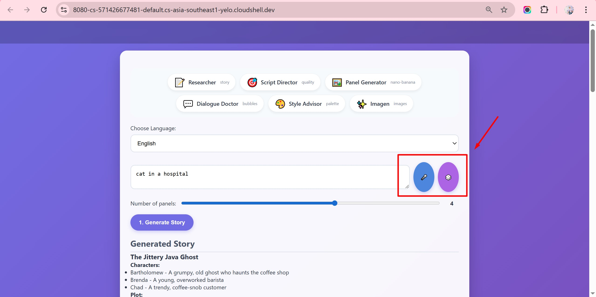
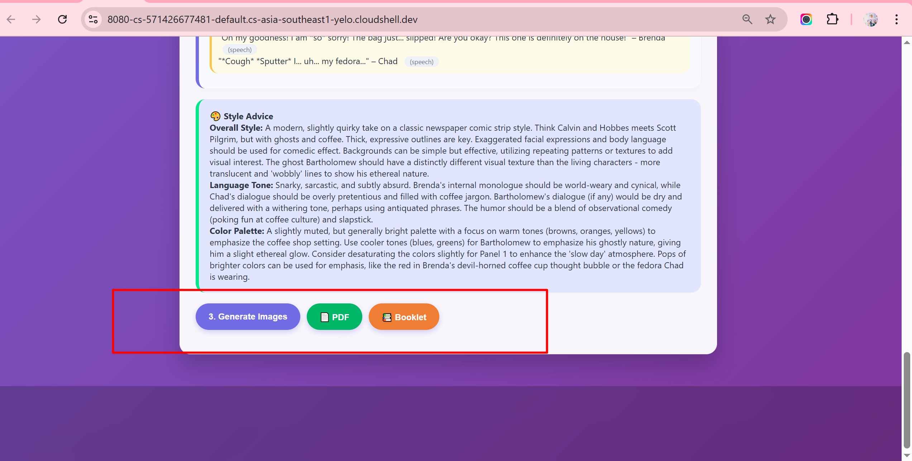
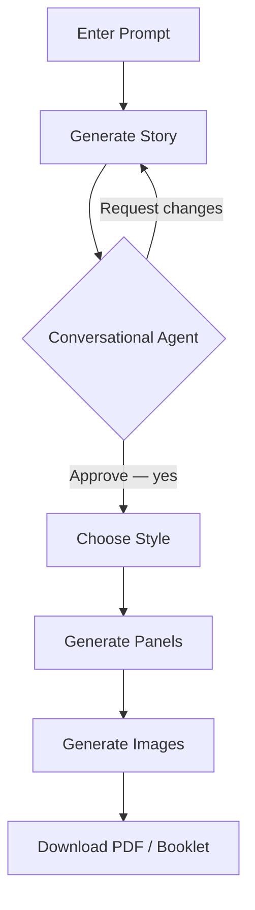
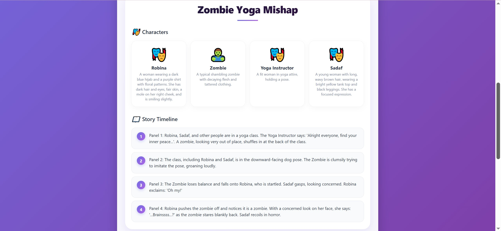
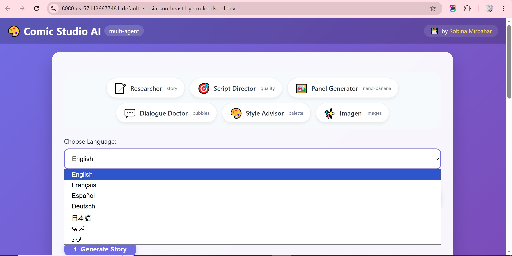

# 📖 Comic Studio AI — Usage Guide

## 📋 Table of Contents

- [🚀 Quick Start](#-quick-start)
- [🎨 Your First Comic](#-your-first-comic)
- [🖥️ Web Interface Guide](#️-web-interface-guide)
- [💬 Conversational Agent](#-conversational-agent)
- [🎨 Style Selection](#-style-selection)
- [📷 Image Upload](#-image-upload)
- [✨ Image Generation](#-image-generation)
- [📥 Download Options](#-download-options)
- [📡 API Reference](#-api-reference)
- [🌐 Languages](#-languages)
- [🎯 Examples](#-examples)
- [🔧 Troubleshooting](#-troubleshooting)

---

## 🚀 Quick Start

```bash
# Navigate to the project directory
cd Comic-Studio-Ai

# Activate your virtual environment
source venv/bin/activate        # Windows: venv\Scripts\activate

# Install dependencies
pip install fastapi uvicorn python-dotenv google-generativeai Pillow reportlab jinja2

# Run the app
python main.py
```

Then open **http://localhost:8080** in your browser.


---

## 🎨 Your First Comic

Follow these seven steps to go from prompt to downloadable comic.

---

### Step 1 — Enter a Prompt

Type your idea in the prompt field, choose a language, and set the number of panels (1–6).

```
┌─────────────────────────────────────┐
│ Language: [English ▼]               │
│ [penguin in a desert]        [🎲]   │
│ Panels: [=====○=====] (4)           │
│ [1. Generate Story]                 │
└─────────────────────────────────────┘
```


**🎤 Voice Input** — Click the microphone button next to the prompt field. Allow browser microphone access, speak your idea clearly (e.g., "a cat in a spaceship"), and the text fills automatically. Works best in Chrome, Edge, or Safari.

**🎲 Random Prompt** — Click the dice button for an instant creative idea.



---

### Step 2 — Generate Story

Click **"1. Generate Story"** to see the AI-generated title, characters, and plot.

```
┌─────────────────────────────────────┐
│ 📖 Generated Story                  │
│ Desert Penguin Adventure            │
│ Characters:                         │
│ • Pingu – A lost penguin            │
│ • Cactus Carl – A grumpy cactus     │
│ Plot:                               │
│ 1. Pingu wakes up in the desert...  │
│ 2. He asks Cactus Carl for water... │
│ 3. Carl points to an oasis...       │
│ 4. Pingu finds water and friends.   │
└─────────────────────────────────────┘
```


---

### Step 3 — Refine with the Conversational Agent

The agent appears after story generation. Request changes in plain language, or say **"yes"** to proceed.

```
🎬  Story created! Try refining it — e.g.:
     "add a dog character"
     "make the penguin braver"
     "change the ending to be funnier"

👤  add a dog
🎬  ⏳ Modifying story...
🎬  Story updated! Keep refining or say "yes".

👤  yes
🎬  Great! Choose your style and click "Generate Panels".
```


---

### Step 4 — Choose Your Style

Select art style, language tone, and an optional color palette hint.

```
┌─────────────────────────────────────┐
│ Art Style:     [Manga ▼]            │
│ Language Tone: [Adventurous ▼]      │
│ Color Palette: [warm]               │
│ [2. Generate Panels]                │
└─────────────────────────────────────┘
```


---

### Step 5 — Generate Panels & Dialogue

Click **"2. Generate Panels"** to get panel descriptions with dialogue and bubble types.

```
┌─────────────────────────────────────┐
│ Panel 1: Wide desert shot, Pingu... │
│ Characters: Pingu                   │
│ Dialogue: "Where's the water?"      │
│ Bubble: speech                      │
│                                     │
│ Panel 2: Pingu meets Cactus Carl... │
└─────────────────────────────────────┘
```


---

### Step 6 — Generate Images

Click **"3. Generate Images"** to render actual comic panels using Imagen. Expect 10–20 seconds for four panels.


Panel examples:


---

### Step 7 — Download Your Comic

Choose **PDF** (one panel per page) or **Booklet** (two panels per page, landscape). Filenames include the story title and a timestamp.

```
┌─────────────────────────────────────┐
│ [📄 PDF]    [📚 Booklet]            │
│ comic_PenguinAdventure_12345678.pdf │
└─────────────────────────────────────┘
```



**Sample comics to download:**

| Language | Format | Download |
|---|---|---|
| English | Booklet | [sample-comic.pdf](https://raw.githubusercontent.com/RobinaMirbahar/Comic-Studio-Ai/main/docs/images/sample-comic.pdf) |
| Urdu | Standard | [comicurdu.pdf](https://raw.githubusercontent.com/RobinaMirbahar/Comic-Studio-Ai/main/docs/images/comicurdu.pdf) |

> The English sample uses the prompt "cat in a hospital". The Urdu sample uses "صحرا میں پینگوئن" (penguin in desert).

---

### 🗺️ Full Workflow



---

## 🖥️ Web Interface Guide

```
┌─────────────────────────────────────────────┐
│  HEADER & AGENT SHOWCASE                    │
│  Researcher · Script Director · and more    │
├─────────────────────────────────────────────┤
│  LANGUAGE SELECTOR   [English ▼]            │
├─────────────────────────────────────────────┤
│  PROMPT INPUT        [🎤] [🎲]              │
├─────────────────────────────────────────────┤
│  IMAGE UPLOAD        [Choose file] (preview)│
├─────────────────────────────────────────────┤
│  PANEL COUNT SLIDER  [=====○=====] (4)      │
│  [1. Generate Story] [📷 Gen. with Image]   │
├─────────────────────────────────────────────┤
│  STORY OUTPUT                               │
├─────────────────────────────────────────────┤
│  CONVERSATIONAL AGENT CHAT                  │
├─────────────────────────────────────────────┤
│  STYLE SELECTION                            │
├─────────────────────────────────────────────┤
│  PANELS & DIALOGUE OUTPUT                   │
├─────────────────────────────────────────────┤
│  [3. Generate Images]  [📄 PDF]  [📚 Booklet]│
└─────────────────────────────────────────────┘
```

Hover over any agent card in the header to see a tooltip describing its role.


---

## 💬 Conversational Agent

After story generation, a chat box appears. Type natural-language requests to modify the story — the agent preserves existing characters and only adjusts what you ask.

**Example requests:**
- `"add a dog character"`
- `"make the plot more adventurous"`
- `"change the main character's name to Fluffy"`
- `"make the ending happier"`

Say **"yes"** when satisfied to move on to style selection.


---

## 🎨 Style Selection

| Option | Choices |
|---|---|
| **Art Style** | Manga, Western, Anime, Watercolor, Sketch, Vintage, Cartoon |
| **Language Tone** | Humorous, Dramatic, Sarcastic, Heartwarming, Adventurous, Mysterious |
| **Color Palette** | Optional hint — e.g., "warm", "pastel", "dark" (leave blank to let AI decide) |

| Style | Description |
|---|---|
| 🇯🇵 **Manga** | Black and white, screentones, speed lines |
| 🇺🇸 **Western** | Bold outlines, vibrant colors, superhero |
| ✨ **Anime** | Vibrant colors, glossy eyes, cel-shaded |
| ✏️ **Sketch** | Pencil sketch, rough lines, hand-drawn |
| 🎨 **Watercolor** | Soft gradients, painted look |
| 📰 **Vintage** | 1950s style, muted colors, halftone dots |
| 🎭 **Cartoon** | Looney Tunes style, exaggerated expressions |


---

## 📷 Image Upload

Upload a character image and the AI will use it as a visual reference for the main character across all panels.

**How to use:**

1. Click **Choose file** in the "Upload a character image" section (JPEG or PNG, max 5 MB). A thumbnail preview appears.
2. Enter a scene prompt (e.g., "a day at the beach").
3. Click the purple **"📷 Generate Story with Image"** button — not the regular story button.
4. Review the story; the AI will describe your character based on the image.
5. Continue normally through style selection, panel generation, and image creation.

**Tips:** Use clear, front-facing images for best character consistency. Works with photos, avatars, and drawings.





Step-by-step screenshots:


---

## ✨ Image Generation

Click **"3. Generate Images"** after generating panels. The app calls Imagen via `gemini-3.1-flash-image-preview` and renders each panel as a base64-encoded PNG. Four panels typically take 10–20 seconds. If generation fails, a styled placeholder appears automatically.


---

## 📥 Download Options

| Format | Layout | Best For |
|---|---|---|
| **PDF** | Portrait, one panel per page | Reading on screen |
| **Booklet** | Landscape, two panels per page | Printing |

Both formats include a title page with style advice. Filenames follow the pattern `StoryTitle_timestamp.pdf`.


---

## 📡 API Reference

**Base URL:** `http://localhost:8080`

### Generate Story

```bash
curl -X POST http://localhost:8080/generate-story \
  -H "Content-Type: application/json" \
  -d '{"topic": "penguin in a desert", "language": "en", "panels": 4}'
```

### Generate Story with Image

```bash
curl -X POST http://localhost:8080/generate-story-with-image \
  -H "Content-Type: application/json" \
  -d '{
    "topic": "penguin in a desert",
    "language": "en",
    "panels": 4,
    "image": "data:image/jpeg;base64,/9j/4AAQ..."
  }'
```

### Refine Story

```bash
curl -X POST http://localhost:8080/refine-story \
  -H "Content-Type: application/json" \
  -d '{
    "story": {...},
    "modification": "add a dog character",
    "language": "en"
  }'
```

### Generate Panels

```bash
curl -X POST http://localhost:8080/generate-panels \
  -H "Content-Type: application/json" \
  -d '{
    "story": {...},
    "style": {"overall_style": "manga", "language_tone": "humorous"},
    "language": "en"
  }'
```

### Generate Images

```bash
curl -X POST http://localhost:8080/generate-images \
  -H "Content-Type: application/json" \
  -d '{
    "panels": [...],
    "style": {...},
    "dialogues": [...],
    "language": "en"
  }'
```

### Download PDF

```bash
curl -X POST http://localhost:8080/download-pdf \
  -H "Content-Type: application/json" \
  -d '{
    "images": [...],
    "style_advice": {...},
    "story_title": "Penguin Adventure"
  }' \
  --output comic.pdf
```

### Download Booklet

```bash
curl -X POST http://localhost:8080/download-booklet \
  -H "Content-Type: application/json" \
  -d '{
    "images": [...],
    "style_advice": {...},
    "story_title": "Penguin Adventure"
  }' \
  --output booklet.pdf
```

For full request/response schemas, see [api.md](api.md).

---

## 🌐 Languages

| Code | Language | RTL |
|---|---|---|
| `en` | English | — |
| `fr` | French | — |
| `es` | Spanish | — |
| `de` | German | — |
| `ja` | Japanese | — |
| `ar` | Arabic | ✓ |
| `ur` | Urdu | ✓ |

RTL layout switches automatically for Arabic and Urdu.



---

## 🎯 Examples

**"cat in a hospital"** — English · 4 panels · Cartoon · Heartwarming
A lost cat who brings unexpected joy to hospital patients.

**"robot on Mars"** — French · 6 panels · Manga · Adventurous
A six-panel comic about a robot exploring the Martian surface.

**"penguin in a desert" / "صحرا میں پینگوئن"** — Urdu · 4 panels · Watercolor · Mysterious
A beautifully illustrated story of a penguin searching for water.

---

## 🔧 Troubleshooting

| Problem | Solution |
|---|---|
| **"Failed to generate story"** | Check your API key and internet connection |
| **Image upload doesn't work** | Ensure file is JPEG or PNG and under 5 MB |
| **Image generation fails** | Confirm your API key has `gemini-3.1-flash-image-preview` access; check logs |
| **PDF download doesn't work** | Generate images first, then try downloading |
| **Agent not adding characters** | Use precise requests like "add a dog character" |
| **Slow on first request** | Expected — Cloud Run cold start; subsequent requests are faster |
| **Arabic/Urdu text not RTL** | Confirm the language selector is set correctly |

---

## 📚 More Documentation

| Doc | Description |
|---|---|
| [api.md](api.md) | Full API reference with request/response schemas |
| [architecture.md](architecture.md) | Multi-agent system and data flow |
| [deployment.md](deployment.md) | Deploying to Google Cloud Run |

---

<div align="center">

**🎨 Happy Comic Creating!**

[🐛 Report an Issue](https://github.com/RobinaMirbahar/Comic-Studio-Ai/issues) · [⭐ Star the Repo](https://github.com/RobinaMirbahar/Comic-Studio-Ai)

</div>
